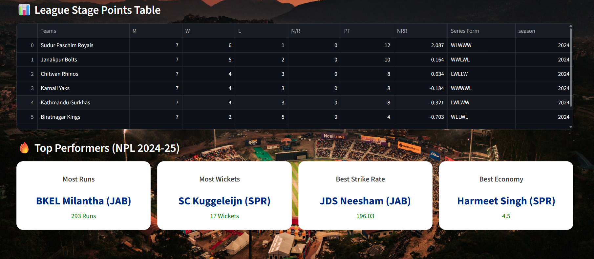
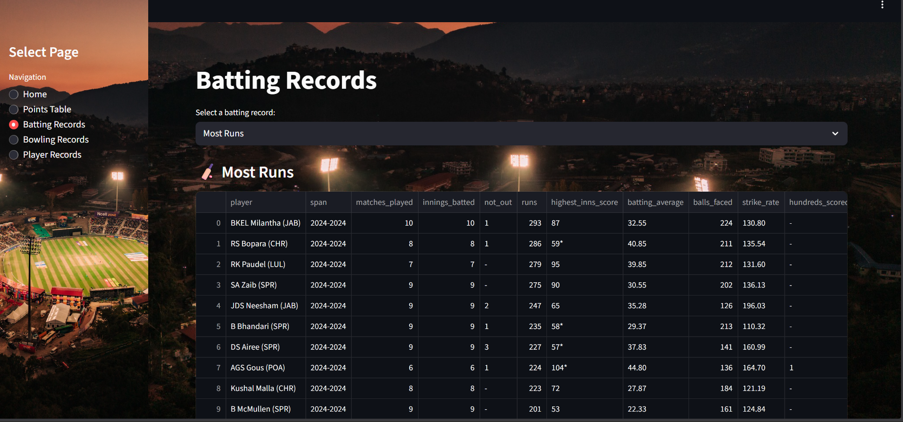
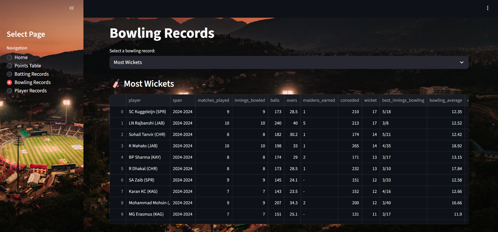
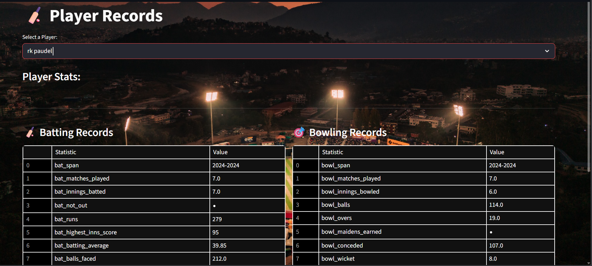

# NPL Dashboard 🏏

**Interactive Dashboard for Nepal Premier League (NPL) data visualization and analysis**

A Streamlit-based dashboard to explore match results, points tables, and other statistics from the Nepal Premier League (NPL) using Python.

---

## 🔗 Live Preview
**

---

## 📁 Repository Structure

NPL-Dashboard/
    - NPL/ # Dataset
    - app.py # Main Streamlit app
    - main.py # Core Python logic
    - main.ipynb # Exploratory Jupyter notebook
    - npl_final_matches.csv # Match dataset
    - pointstable.csv # Points table dataset
    - ptables.csv # Additional stats dataset
    - requirements.txt # Python dependencies


---

## 🚀 Features

- Interactive visualization of **NPL match statistics**
- Display **league points tables**
- Data exploration through **charts and tables**
- Streamlit-based **user-friendly interface**

---

## 🛠 Technologies Used

- **Python 3**
- **Streamlit** – Dashboard framework
- **pandas** – Data manipulation
- **Plotly / Matplotlib** – Charts (if used)
- **Jupyter Notebook** – Data exploration

---

## 📦 Installation & Setup

1. **Clone the repository**

```bash
git clone https://github.com/ChaliseRajesh19/NPL-Dashboard.git
cd NPL-Dashboard
```
2. Install Dependencies
```bash
pip install requirement.txt
```
3. Run the Streamlit Dashboard
```bash
streamrun run app.py
```

4.Open the browser

## 💡 How It Works

    - Loads match and points table CSV files.

    - Processes and analyzes data using pandas.

    - Displays interactive tables and charts in Streamlit.

    - Users can explore league statistics via the dashboard interface.


## 🎯 Future Improvements

    - Add team-wise and date-wise filtering

    - Include multi-season NPL data

    - Integrate ML predictions for matches


## 👏 Contributing

- Contributions are welcome!

- Open an issue to report bugs or request features.

- Submit a pull request for improvements.


## Screenshot





